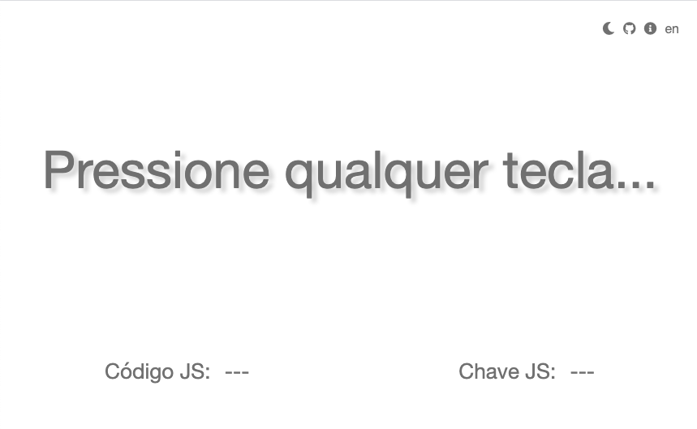
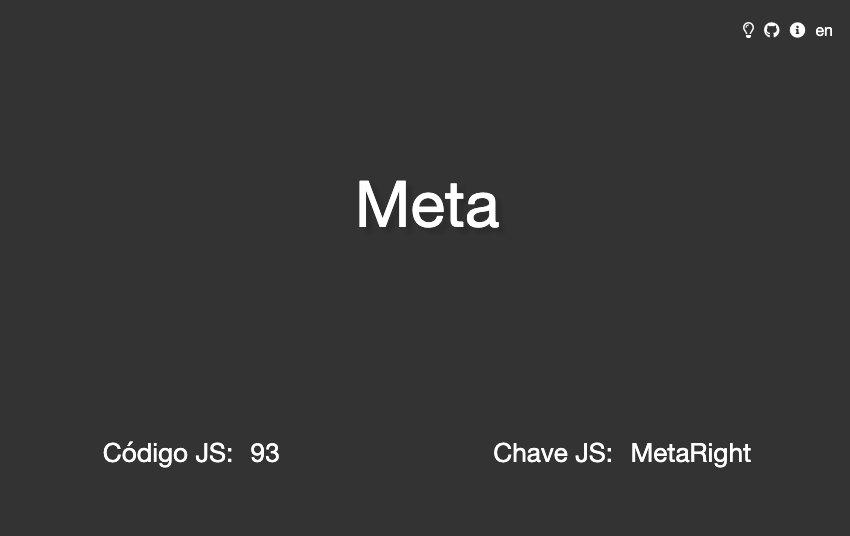

# r-wkit

## en
Another [W]hat [K]ey [I]s [T]his solution.

Press any key to see the JS event value for keypressing.

## pt-BR

Pressione qualquer tecla para ver o valor lido pelo JavaScript.

## Demos

